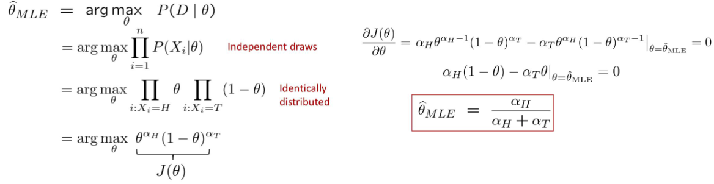
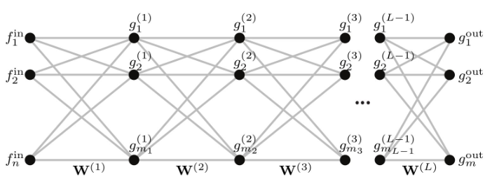
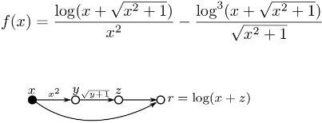
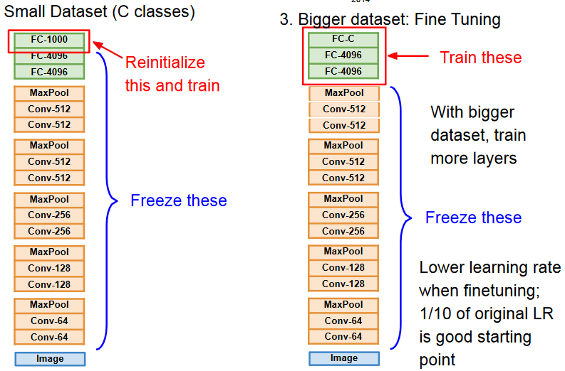
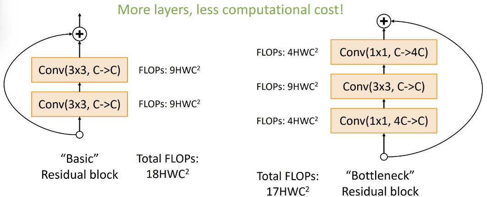
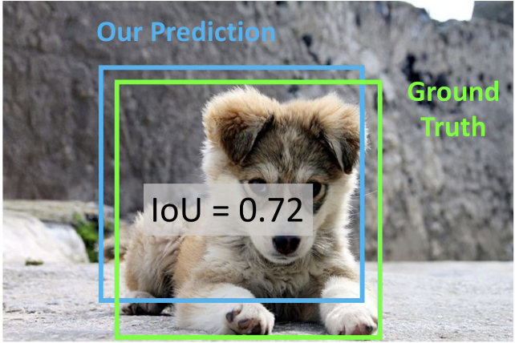

# AML questions
## Lesson 1
1. **Bayes Rule** : Given by the formula $P(A|B) = \frac{P(B|A)}{P(B)}P(A)$ where $P(A|B)$ is the probability of event A given that event B has occurred, $P(B|A)$ is the probability of event B given that event A has occurred, $P(A)$ is the prior probability of event A, and $P(B)$ is the prior probability of event B.
      - We can always rewrite a joint distribution over two variables as a conditional distribution : $P(A,B) = P(A|B)P(B) = P(B|A)P(A)$
      - From the Bayes rule we obtain that $P(A|B) \propto P(B|A)P(A)$
1. **Naive Bayes Assumption** : Given that $P(A|B)P(B)$ is the main term of the Bayes rule, note that estimating $P(B)$ is easy, but estimating $P(A|B)$ is hard. To make it easier we can assume that **attributes are indipendent** given the class, so we can write that $P(A|B) = \prod_{i=1}^{n}P(B_i|A)$.
1. **Naive Bayes classifier** is a probabilistic classifier that is based on the (Naive) Bayes rule and the assumption that the features are conditionally independent given the class. 

## Lesson 2
1. **Generative vs Discriminative Learning**
      - **Generative learning** aims to learn the joint probability distribution $P(Y,X) = P(X|Y)P(Y)$ of both the input features $X$ and the output $Y$ and then infer $P(Y|X)$ from those. They can be used to generate new samples from the input distribution.
      - **Discriminative learning** aims to directly estimate the conditional probability distribution $P(Y|X)$ of the output $Y$ given the input features $X$. They directly learn how likely a given input is to belong to a particular output class. Good when is hard to model the underlying distribution of the data (images etc..).

1. **Bayesian learning**: calculates the probability of each hypothesis and, given the data, makes predictions on that basis.

2. **Maximum A Posteriori (MAP) Estimation** seeks to find the value of a parameter that maximizes the posterior probability distribution, taking into account both the likelihood of the data and the prior distribution.

3. **Maximum Likelihood Estimation (MLE)** seeks to find the value of a parameter $\theta$ that maximizes the likelihood of the observed data, assuming a particular probability distribution. For large amounts of data, we can approximate MAP by MLE and use it to approximate our parameters.

## Lesson 3
1. **Loss Functions** : We define the loss $L(h(X),Y)$ of the classifier $h(X)$ the function that measures the error between the assigned predictions and the true labels $Y$. Various types of loss exists like:
      - **Adversarial Loss** : Used in GANs, aims to minimize the difference between the generated distribution and the true distribution by maximizing the probability that the domain discriminator confounds the two domains. 
      - **Cross-Entropy Loss** : Used in classification problems, it measures the difference between two probability distributions. $ L = \frac{1}{N} \sum_{i=1}^{N} y_i \log(\hat{y}_i) $ where $y_i$ is the true distribution of the i-th sample and $\hat{y_i}$ the predicted distribution.
1. **True Risk** of a classifier $h$ is the probability that it does not predict the correct label for a given input $X$, drawn from the distribution $D$ given by $R_D(h) = P(h(X) \neq Y)$
      - We can also see the True Risk of a classifier as the **Expected Value** of the loss function over the distribution of the data.
1. **Bayes Risk vs Empirical Risk**
      - **Bayes risk** is the expected loss (True Risk) of a bayes classifier over the current distribution of the data. It is the best possible performance that can be achieved for a given problem and cannot be improved.
      - **Empirical risk** $R_D(h)$ over the distribution $D$ is the average loss of the classifier over the training data. It is an estimate of the True Risk. It's impossible to obtain $R_D(h) = 0$ even with a Bayes Classifier. The predictions of any model are only approximately correct, so we'll allow our model to fail with a probability $\delta \in (0,1)$. $R(h) = \frac{1}{m}\sum_{i=1}{m}$
      - **Empirical Risk Minimization** 
2. **PAC Learnability**:  An Hypothesis Class $H$ is PAC-learnable if there exists a function $m_H$ that, given enough samples, produces (with a certain probability $1-\delta$) an hypothesis that can achieve a true risk $R_D(h) \leq \epsilon$.
      - Directly from the definition of Empirical Risk, we can see that a model is PAC-learnable if, given enough samples, the empirical risk is close to the true risk ($R_D(h) \leq \epsilon$) with a certain probability $(1 - \delta)$. So our model should be Probably (with probability $1-\delta$) Approximately (with error $\epsilon$) Correct.
      - The number of samples $m_H$ needed to achieve this over $H$ is called the **sample complexity** of the hypothesis class $H$, note that also depends on $\ln(|H|)$ and $H$ itself could be infinite. 
      - Since we're using a computer, we're discretizing the $H$ space, so we can say that $|H|$ is finite and the sample complexity is finite too. Given, for example 32 bit per parameter we can have at most $|H| \leq 2^{32d}$ so $\ln(2^{32d}) \leq 10d$ and from this the obtain the **rule of thumb** of taking at least a # of samples 10 time the # of parameter.
3. **Overfitting and Underfitting**
      - **Overfitting** is a phenomenon that occurs when a model is **too complex** or flexible and fits the training data too closely (including noise), resulting in poor performance on unseen data (test data) due to the model's inability to generalize.
      - **Underfitting** is a phenomenon that occurs when a model is **too simple** to capture the underlying patterns in the data. As a result it performs poorly on both the training and unseen data.
      - A solution against overfitting is to use a **regularization** term that penalizes the complexity of the model. For example a special case of **Empirical Risk Minimization** can be obtained adding a parameter $\lambda$ to the loss function that penalizes the complexity of the model.
4. **K-Fold Cross Validation** is a technique used to evaluate the performance of a machine learning model. The training data is divided into K subsets, and the model is trained K times, each time using K-1 subsets for training and the remaining subset for validation. The performance of the model is then averaged over the K runs. 
      - If K is equal to the number of samples, it is called Leave-One-Out Cross Validation.
1. **Linear Regression Algorithms** are used to predict a **continuous** output variable based on the input features. In classification $Y = {1,2,3,...,K}$, in regression $Y \in \mathbb{R}$.
      - **Loss Functions** for regression are typically based on the difference between the predicted value and the true value. A common loss function is the Mean Squared Error (MSE) $L(y,\hat{y}) = (y-\hat{y})^2$.
      - **Linear Regression** is a simple and commonly used regression algorithm that models the relationship between the input features and the output variable as a linear function.
      - **Ridge Regression** is a variation of linear regression that adds a regularization term to the cost function, to prevent overfitting.

## Lesson 4
1. **Logistic Regression** is a non-linear regression algorithm that is used for binary classification. It models the probability that an input belongs to a particular class using the logistic function. The loss function is :
$$l({x_i,y_i}) = \sum_{i=1}^n(y_i-\sigma(ax_i+b))^2$$ 
We can rewrite the loss function to have a convex problem as :
$$l({x_i,y_i}) = \sum_{i=1}^ny_i\ln(\sigma(ax_i+b)) + (1-y_i\ln(1-\sigma(ax_i+b)))$$
But that function still has no analytical solution, so we use the **Gradient Descent** algorithm to minimize the loss function.

2. **Gradient Descent** is a first-order algorithm used to minimize a loss function by **iteratively updating** the parameters of the model in the direction of the negative gradient of the loss function : $x^{(t+1)} = x^{(t)} - \alpha \nabla f(x^{(t)})$ and is orthogonal to level surfaces. It requires that the function $f$ is **differentiable** at all points. 
      - **Stationary point** is a point where  $\alpha \nabla f(x^{(t)}) = 0$ so the algorithm "remain stuck" at that point. We have no guarantee that the point is a minimum, it could be a saddle point for example. On the other hand in DL we're not interested in the global minimum because it would cause overfitting.
      - The **Learning Rate** $\alpha$ is a hyperparameter that controls the size of the updates. If the learning rate is too small, the algorithm may take a long time to converge, while if it is too large, the algorithm may oscillate or diverge. The size of the step is given by $\alpha ||\nabla f||$. The learning rate can be fixed, adaptive or follow a schedule. 
      - *decay* is a technique used to reduce the learning rate over time, which can help the algorithm to converge more effectively.
      - *momentum* is a technique used to accelerate the convergence of the algorithm by adding a fraction of the previous update to the current update. 
      - Two major bottlenecks of the GD algorithm make it unsuitable for Deep Learning: the number of samples (we're computing the gradient over the entire dataset) and the number of parameters (milions of parameter!).

3. **Stochastic Gradient Descent (SGD)** is a variant of gradient descent that updates the parameters of the model using an **approximation of the gradient** obtained from a **single batch of data** $B$ at a time, rather than the entire training set. This can lead to faster convergence, but it can also be more noisy and may require more iterations to converge. Small batches can also offer a regularization effect. Compared to GD, SGD can find low value of the loss quickly enough to be useful in DL, even if most of the time it's not the minimum.

4. **Learning Rate Schedules** are used to adjust the learning rate over time, according to some kind of scheduel, to improve the performance of the model. Some common learning rate schedules include:
      - **Step Decay** : The learning rate is reduced by a factor every few epochs (for example halfed every 10 epoch).
      - **Exponential Decay** : The learning rate is reduced exponentially over time. $lr = lr_0 * e^{(−kt)}$
      - **Cosine** : The learning rate is reduced according to a cosine function. 

5. **Optimizers** are a technique used to update the parameters of the model during training. Some common optimizers include:
      - **Stochastic Gradient Descent (SGD)** : Implements the Stochastic Gradient Descent algorithm to update the model parameters based on an approximation of the gradient obtained from a small batch of samples. I can adopt momentum and decay.
      - **Adam** : is a stochastic gradient descent method that is based on adaptive estimation of first-order and second-order moments. It is computationally efficient and is widely used in deep learning.
      - **RMSprop** : An optimizer that uses an adaptive learning rate to update the parameters of the model. It is similar to Adam but does not use momentum.

## Lesson 6
1. **The perceptron** is a simple classifier loosely inspired by the way neurons work in the brain. It is used for binary classification and is based on the product of the **input features** and the **weights**, which are then summed and passed through an **activation function**. If the sum is greater than a threshold, the perceptron outputs +1, otherwise it outputs -1.
To train the perceptron, it computes one sample at a time,if the sample is correctly classified the weights remain the same, otherwise the weights are updated by adding/removing the sample(feature vector) to the weights.
If the data is **linearly separable**, the perceptron algorithm is guaranteed to converge to a solution. If the data is not linearly separable, on the other hand, there is a risk that the weights will become trash and the network will not converge.

1. A **deep feed-forward neural network**, or multilayer perceptron (MLP), is a type of neural network that consists of multiple layers of **neurons**, including an input layer, one or more hidden layers, and an output layer. Each neuron in the network is connected to every neuron in the adjacent layers, and each connection has a weight associated with it. In each neuron we have a *linear combination of weights and input values*, which is then passed through an **activation function** (non-linear). The network is trained using gradient backpropagation.

1. **Universal Approximation Theorem** states that a feed-forward neural network with sigmoid activation layers and a single hidden layer containing a finite number of neurons can approximate any continuous function to arbitrary accuracy, given enough neurons. This means that a neural network can learn to represent any function, given enough neurons and training data.
      - "For any continuous function $f(x)$ and any $\epsilon > 0$, $\exists$ $q\in\N$ that :  
            $|f(x) - \sum_{k=1}^q u_k\phi(x)| < \epsilon$  
            where $u_k$ are the weights and $\phi(x)$ is the sigmoid function $\sigma(Wx+b)$."
1. **Why non linearity is important in cnn?**
      - Non-linearity is important in CNN because it allows the network to learn more complex representations of the data. This is because linear functions can only represent linear relationships, but non-linear functions can represent more complex relationships.

1. **MLP Training** : Given an MLP $g_\Theta (x) = ... = y$ with training pairs $(x_i,y_i)$, we want to find the parameters $\Theta$ that minimize the loss function $L_\Theta({x_i,y_i}) = \frac{1}{n}\sum_{i=1}^n ||y_i - g_\Theta(x_i)||^2_2$.  
In general the loss function is not convex, so we use the **Gradient Descent** algorithm to minimize the loss function, but it needs to compute the gradient $\nabla l_\Theta$ which is **really difficult**.
      - **Computational Graph** is a directed, acyclic graph representing the computation of a generic function $f$ with intermediate variables. Is used to decompose complex functions into simpler parts and to compute the derivatives of the function with respect to its parameters.
      - **Forward Mode** is a technique used to compute the **derivatives** of a function by computing all the partial derivatives with respect to the input $\frac{\partial x}{\partial x} = 1$. The main problem of this approach is that its complexity depends on the dimensionality of the input.
      - **Backward Mode** differenly from the Forward Mode, computes the derivatives of the function with respect to the inner nodes of the computational graph $\frac{\partial f}{\partial f} = 1$ and then propagates the gradient backwards. It's more efficient than the Forward Mode because its complexity depends on the dimensionality of the output.

1. **Backpropagation** (reverse-mode automatic differentiation) is a technique used to compute the gradient of a loss function with respect to the parameters of a neural network. It is based on (not only) the chain rule of calculus and is used to update the weights of the network during training. The main steps of the backpropagation algorithm are:
      - **Forward Pass** : Compute the output of the network for a given input.
      - **Backward Pass** : Compute the gradient of the loss function with respect to the output of the network, and then use the chain rule to compute the gradient of the loss function with respect to the parameters of the network.
      - **Update the Weights** : Use the gradient to update the weights of the network using an optimization algorithm such as gradient descent.

1. **Special cases** : We've seen that in some special cases the loss is convex :
      - One layer, no activation function, MSE loss is **linear regression**.
      - One layer, sigmoid activation function, logistic loss is **logistic regression**.   

1. **MPL Training Problems** : There are two main problems regarding the training of a deep neural network in general :
      - The loss wil be **non-convex** with multiple local minima, and the optimum reached depends also on the initialization of the weights. Note that we're not interested in the global minimum because it would cause overfitting.
      - The loss will be non-differentiable in some points, so numerical issues can arise and there are a lot of tricks needed to avoid them (for example the ReLU is non differentiable in 0, but we can use the subgradient).
## Lesson 7

1. **Priors**: Data often carry structural priors that can be used to "simplify" the network and thus reduce the number of connections and parameters.Common priors in images are **repeating patterns**, locality, structure, etc. Data tends to be self-similar across the domain (same patterns but slightly different content, etc.).
      - For example, we want a translation invariant model because we expect the same object (or the same *feature*) to be recognized even if it is at a *different* position in the image.

1. **Convolutional Neural Networks (CNNs)** are a type of neural network that is well-suited for tasks such as image recognition and classification. They use a special type of layer called a **convolutional layer**, which applies a set of filters (kernel) to the input data to extract features. CNNs also use other types of layers such as pooling layers and fully connected layers to further process the data and make predictions.

1. The **Convolution** is a function obtained by the integral of the product of two functions after one is reversed and shifted. $f*g(t) = \int_{-\infty}^{\infty} f(\tau)g(t-\tau)d\tau$.  
      In the case of CNNs, the convolution is a discrete convolution, and the kernel is the *filter* that is applied to the input data to extract features.

1. **Convolutional Layer** is a layer that **convolves** the input data with a set of filters to extract features. This can help the network to learn to recognize patterns in the input data. The output size of the convolutional layer is given by the formula $O = \frac{N-F+2P}{S} + 1$ where $N$ is the input size, $F$ is the kernel size, $P$ is the padding and $S$ is the stride.  
      Each filter in the convolutional layer can learn to recognize different patterns and features in the input data. 
      - **Example** : with an input of size 3x32x32 and a filter of size 3x5x5 with a stride of 1 and no padding, the output will be 1x28x28. The result of each single convolution between the filter and a 3x5x5 subset of data will be a **single number** that "contains" informations about the whole subset. After the filter is fully convolved with the input data, the result is a single **feature map**. We can have multiple filters in the same layer to obtain multiple feature maps that are then stacked together (a 6x3x5x5 filter would gives us a 6x28x28 feature map). 
      - **Padding** is a technique used to add extra pixels around the input data to control the spatial dimensions of the output data. It can help to prevent the spatial dimensions of the data from shrinking too much and/or to introduce a little bit of noise. It's common to use a padding that keeps the spatial dimensions of the input data unchanged after the convolution ($P=\frac{F-1}{2}$ and stride of 1).
      - **Zoom Effect** : Even if the kernel is chosen to mantain the same dimensionality of the input, each pixel in output will summarize a larger portion of the input, so the output will be a **zoomed-out** version of the input.
      - **Hyperparameters** : There are 4 hyperparameters that can be tuned in a convolutional layer : $K$ (number of filters), $F$ (filter size), $S$ (stride) and $P$ (padding). The number of parameters in a convolutional layer is given by $K \cdot F \cdot F \cdot C$ where $C$ is the number of channels of the input data.
1. **Pooling Layer** is a layer that reduces the spatial dimensions of the input data by combining nearby values. This can help to reduce the computational cost of the network and make it more robust to small variations in the input data. An example of pooling is the Max Pooling layer. Note that the pooling layer hasn't any parameters to learn.
      - **Max-Pooling Layer** takes the maximum value of a subset of the input data, introducing invariance to small spacial shifts 
      - **Average-Pooling Layer** takes the average value of a subset of the input data.
      - **Global Average Pooling** is a pooling operation designed to replace fully connected layers in classical CNNs. Instead of adding fully connected layers on top of the feature maps, we take the average of each feature map, and the resulting vector is fed directly into the softmax layer. 

1. **Fully Connected Layer** is a layer that connects every neuron in one layer to every neuron in the next layer. This is the final layer of the network and is used to make predictions.

## Lesson 8

1. **Batch Normalization** is a technique used in deep networks to **normalize** (zero mean and unit variance) the output of a layer before it is passed to the next layer. Note that this is a **differentiable function**, so it can be trained with backpropagation. The params of the layer ($\gamma$ and $\beta$) are learned during training rather than picked as hyperparameters. Note that at test time the BatchNormalization layer will act differently, using a fixed mean and variance computed during training. Usually inserted after Fully Connected or Convolutional layers and before the activation function (non-linearity).
Batch Normalization can help to:
      - Optimize the **Internal Covariate Shift** that is the dynamic change of weights and biases of the network during training. An Internal Covariance Shift too big can slow down the training of the network.
      - Improve gradient flow through the network, which can help to speed up training and reduce the risk of vanishing or exploding gradients.
      - Reduces the dependence of the network on the initial values of the weights and biases, which can make training more stable and less sensitive to the choice of hyperparameters.
      - Acts as a form of **regularization** by adding noise to the input of the layer, which can help to prevent overfitting.

1. **Activation Functions** are used to introduce non-linearity into the output of a neuron. 
There are different possible activation functions that can be used in neural networks, such as the sigmoid, tanh, ReLU, and softmax functions. 
      - **Sigmoid** is a non-linear activation function that squashes the input to the range [0, 1]. Has three main problems: the vanishing gradient problem, the output is not zero-centered and the exp() function is computationally expensive.
      - **Tanh** is a non-linear activation function that squashes the input to the range [-1, 1]. It's zero-centered but still has the vanishing gradient problem.
      - **ReLU** (Rectified Linear Unit) is a non-linear activation function that returns the input if it is positive, and zero otherwise. It is commonly used in Neural Networks because it is computationally efficient and does not suffer from the vanishing gradient problem. However, it can suffer from the "dying ReLU" problem, where neurons can become inactive and stop learning, and has a non-zero centered output.
      - **Leaky ReLU** is a variation of the ReLU activation function that allows a small gradient when the input is negative, which can help to prevent the "dying ReLU" problem.
      - **ELU** (Exponential Linear Unit) is a non-linear activation function that returns the input if it is positive, and an exponential function of the input otherwise. It is similar to the ReLU function, has an output closer to zero-mean but is computationally expensive.

The best choice of activation function remains the **ReLU** function, using a Leaky ReLU or ELU function can improve just a little bit the performance of the network.

3. **Data Preprocessing** is a technique used to prepare the input data for training a neural network. This can help to improve the performance of the network and reduce the risk of overfitting. Note that for images we wanto to avoid too complex preprocessing (PCA etc), here are three common techniques:
      - Subtract the mean image 
      - Subtract per-channel mean (3 numbers)
      - Subtract per-channel mean and Divide per-channel std (3 numbers)

3. **Weights Initialization** is an important aspect of training neural networks. The initial values of the weights can have a significant impact on the performance of the network. 
      - **Zero Initialization** is a method for initializing the weights of a neural network that sets all the weights to zero. Not recommended because it can lead all the layers to evolve in the same way loosing the specialization.
      - **Random Initialization** sets all weights to random values. This can help to break the symmetry of the network but works only on small networks, on deeper networks can couse problems with the gradient.
      - **Xavier Initialization** is a weights initialization method for a neural network that is designed to keep the **variance** of the activations constant across layers. It is based on the assumption that the input and output of each layer are normally distributed. The Xavier initialization method scales the weights by a factor of $\sqrt{\frac{1}{n_{in}}}$ where $n_{in}$ is the number of input units to the layer. It works only with the tanh activation functions. 
      - **MSRA Initialization** is a variation of Xavier initialization that is designed to work better with the ReLU activation function. It scales the weights by a factor of $\sqrt{\frac{2}{n_{in}}}$ where $n_{in}$ is the number of input units to the layer.
      - **ResNets Initialization** is similiar to MSRA but, for each residual block, the first is initialized with MSRA and the second with 0s.

1. **Dropout** is a regularisation technique used in neural networks to prevent overfitting. It works by dropping a random fraction of the nodes at each update during training. The probability of dropping a unit is an adjustable hyperparameter (usually 0.5). It forces the network to have a redundant representation and thus better generalisation. It can also be seen as training an ensemble of networks. Usually done in fully connected layers to reduce complexity. At test time, all neurons are active, but their output is scaled by the dropout probability (or divided at test time).

1. **Data Augmentation** is a technique used to increase the amount of data available at training time by applying transformations to the input data. This can help to improve the performance of the network and reduce the risk of overfitting. Common data augmentation techniques include flipping, rotating, scaling, and cropping the input data.

1. **Model Ensembling** is a technique used to improve the performance of a machine learning model by training independent models and combining their predictions. At test time average the predictions of the models. Small increase in performance and it's computationally expensive.
      - An alternative is to take snapshots of the model at different times during training and average the predictions of the N best snapshots at test time. This can help to improve the performance of the model and reduce the risk of overfitting.

## Lesson 9

1. **Hyperparameter Tuning** is the process of finding the best set of hyperparameters for a machine learning model. This can be done using techniques such as **grid search** or random search. The best set of hyperparameters is the one that results in the best performance on a validation set.
      - The **Grid Search** is obtained by creating a table with all the possible parameters (and all their possible values) and train a different model for each possible parameters combination. It's really long and expensive.

1. **Early Stopping** is a technique used to prevent overfitting in machine learning models : training for too long can lead to overfitting. The idea behind early stopping is to halt the training when the performance of the model on the validation set starts to decrease while are still increasing on the training set. This can help to prevent the model from learning the noise in the training data and improve its generalization performance.

2. **Transfer Learning and Fine Tuning**
   - **Transfer learning** is a technique where a pre-trained model is used as a starting point for a new task, rather than training a model from scratch. This can save time and resources, and also improve performance. With Transfer Learning, the weights of the pre-trained model are frozen, and only the weights of the last layer are trained on the new task. An example is using a model pre-trained on ImageNet to perform image classification on a new dataset, changing only the last layer.
   - **Fine-tuning** is a similar technique where the weights of the pre-trained model (more layers) are updated for the new task, typically by using a smaller learning rate. The number of layers that we want to re-learn depends on the size of the new dataset and the similarity between the new and the old dataset.  

3. **AlexNet** is the first Deep Convolutional Neural Network that won the ImageNet competition in 2012. It is composed of 5 convolutional layers, 3 max-pooling layers, and 3 fully connected layers. It uses the ReLU activation function and dropout for regularization. It also uses data augmentation and batch normalization to improve the performance of the network.

## Lesson 10

1. **GoogleNet** is a deep convolutional neural network that was designed to be computationally efficient (no Fully Connected layers) while achieving high performance on image classification tasks. It uses a module called an **Inception module** that combines multiple convolutional layers with different kernel sizes and pooling layers to extract features from the input data. The network also uses **global average pooling** instead of Fully Connected layers to reduce the spatial dimensions of the input data before making predictions. The network is too deep to be trained only with loss at the end, so it uses two **auxiliary classifiers** to help the training of the network.

2. **Residual Networks (ResNets)** are a type of deep convolutional neural network that use a special type of layer called a **residual block**. A residual block consists of a set of convolutional layers followed by a **skip connection** that adds the input to the output of the convolutional layers. This allows the network to learn the residual (difference) between the input and the output, which can help to prevent the vanishing gradient problem and make it easier to train very deep networks. The skip connection can be implemented in different ways, such as adding the input to the output.
      - **Residual Blocks** are made up of two convolutional layers and a skip connection. The stripe and padding of each convolutional layer are chosen to keep the spatial dimensions of the input data unchanged.
      - **Bottleneck Residual Blocks** are a variation of the residual block that uses a 1x1 convolutional layer to reduce the number of channels before applying the 3x3 convolutional layer, and then uses another 1x1 convolutional layer to increase the number of channels back to the original value. This can help to reduce the computational cost of the network.

3. **Neural Architecture Search (NAS)** is a technique used to automatically design the architecture of a neural network. One controller outputs network architectures that are then trained and evaluated. After training a bunch of models, make a gradient step on the controller. Over time the controller model will learn to generate better architectures. The search space is really large and the training of the models is computationally expensive.

## Lesson 11
1. **Multitask Learning** is a technique where a model is trained to perform multiple tasks simultaneously. This can help to improve the performance of the model by allowing it to learn shared representations of the data that can be used for multiple tasks. The model is trained on a joint loss function that combines the losses of the individual tasks.
      - Multi-task vs Transfer Learning: In multi-task learning, the model is trained to perform multiple tasks simultaneously, while in transfer learning, a pre-trained model is fine-tuned for a new task.

1. **Object Detection** is the task of identifying and localizing (multiple) objects within an image or video. Various techniques can be used for object detection, such as sliding window, region-based, and single-shot detection methods.
      - **Sliding Window** Apply a CNN to many different crops of the image, CNN classifies each crop as object or background. The main problem is the computational cost (an 800x600 images has 58M boxes).
      - **R-CNN** Use a **region-proposal** (selective search) algorithm to propose a set of regions with "blobby" shapes, then the CNN is applied to each region. The main problem now is the selective search algorithm that is slow and produces too many regions.
      - **Fast R-CNN** Runs th whole image through the Backbone CNN to extract a feature map of the image, then selects the RoIs with a proposal method and applies smaller CNNs to each RoI. The main problem is how to crop and resize the RoIs to match the original image (RoI Pool vs RoI Align).
      - **Faster R-CNN** Uses a Region Proposal Network (RPN) after the backbone to generate the RoIs, then applies the Fast R-CNN to each RoI. The RPN is a small CNN that takes the feature map of the image and outputs the RoIs.
      - **Single Stage Detector** (SSD, YOLO) are object detection algorithms that use a single network to predict the bounding boxes and class labels for all objects in an image. They are faster than two-stage detectors but may have lower accuracy.

2. **Intersection over Union (IoU)** is a metric used to evaluate the performance of object detection algorithms. It measures the overlap between the predicted bounding box and the ground truth bounding box. The IoU is calculated as the **area of intersection** between the two bounding boxes divided by the **area of union** between the two bounding boxes.  

3. **Non-Maximum Suppression (NMS)** is a technique used to reduce the number of overlapping bounding boxes produced by an object detection algorithm. It works by selecting the bounding box with the highest confidence score and removing any other bounding boxes that have a high overlap with it. This can help to improve the precision of the object detection algorithm.

4. **RoI Pool vs RoI Align**
   - **RoI Pooling** is a technique used in object detection algorithms to extract features from a region of interest (RoI) in an image. It works by dividing the RoI into a grid of sub-windows and then "snapping" the features to the grid. This can lead to a loss of information and reduce the accuracy of the object detection algorithm.
   - **RoI Align** is a variation of RoI pooling that uses **bilinear interpolation** to align the features with the grid. This can help to preserve the spatial information and improve the accuracy of the object detection algorithm.

5. **Semantic Segmentation** is a fundamental topic in computer vision that aims to classify each pixel in an image according to the object (class) it belongs to. It is a pixel-level classification task that can be used to create detailed and accurate object masks. Various techniques can be used for semantic segmentation, such as fully convolutional networks and U-Net.

1. **Fully Convolutional Networks (FCNs)** are used to perform semantic segmentation by applying **downsampling** and **upsampling** within the network.
First, a series of convolutional layers are applied to the input image to extract the **feature vector**. The network is then designed to upsample the feature vector and the output is a **pixel-wise** classification with the original image size $C$ x $H$ x $W$, where $C$ is the number of classes. 
      - The **downsampling** is performed by applying a series of convolutional layers alternating with pooling layers. The convolutional layers are used to extract the features from the input image, while the pooling layers are used to reduce the spatial dimensions of the feature map.
      - **Upsampling** is performed by applying "unpooling" layers such as Bilinear Interpolation, Max Unpooling, etc. No learning is involved with these types of layers. An alternative is **Transposed Convolution**, which is a learnable layer that can be used to upsample the feature map.

1. **Instance Segmentation** is the task of identifying and localising each object instance in an image. It is a combination of object detection and semantic segmentation and can be used to create detailed and accurate object masks for each object in an image. Can be performed with a **Mask R-CNN**, which extends the Faster R-CNN by adding a new task after RoI pooling: **Mask Prediction**.

1. **Panoptic segmentation** is the task of simultaneously performing semantic segmentation and instance segmentation on an image (classifying each pixel and assigning different object instances in the image). It can be used to create detailed and accurate object masks for each object in an image and to classify each pixel according to the object it belongs to.

## Lesson 12

1. **Sequential Data** are informations that are not related to a single instant, but are extended in time. Examples can be Music, Text, Stock Exchange, Weather, etc. 

2. **Different Tipes of Networks**
      - **One-to-One** : "vanilla" networks, takes a single input and produces a single output.
      - **One-to-Many** : Takes a single input and produces multiple outputs. An example can be Image Captioning, where the network takes a single image in input and produces multiple words.
      - **Many-to-One** : Takes multiple inputs and produces a single output. An example can be Sentiment Analysis, where the network takes multiple words in input and produces a single sentiment.
      - **Many-to-Many** : Takes multiple inputs and produces multiple outputs. An example can be Machine Translation, where the network takes multiple words in input and produces multiple words in output.

3. **(vanilla) Recurrent Neural Networks (RNNs)** are a type of neural networks that have an **internal state** that is updated as a sequence is processed. The new state of the network is given by both the old state and the input. In "vanilla" RNNs we have a **single set of weights** that is used at every time step, so the same parameters must work with all the elements.
      - **Backpropagation Through Time (BPTT)** is a technique used to train RNNs by unrolling the **whole network** through time and applying backpropagation to update the weights. The main problem is the vanishing gradient problem, that can make the training of the network really slow and unstable for bigger texts.
      - **Truncated BPTT** is a variation of BPTT where the text is truncated into parts (chunks) and the weights are updated at the end of each chunk. This can help to reduce the computational cost of training the network.

4. **(vanilla) RNNs problems** are related to the use of a single weight matrix for all the time steps. The main problems are :
      - **Vanishing Gradient** : If the largest singular value of the weight matrix is less than 1, the gradient will vanish over time.  Can be solved only by changing the architecture of the network.
      - **Exploding gradient** : If the largest singular value is greater than 1, the gradient will explode over time. Can be solved with **gradient clipping**.

5. **Long Short-Term Memory (LSTM) Networks** are an extension of vanilla RNNs used to solve the vanishing gradient problem. In LSTM (other than input and state) we have also a **cell state** that won't be exposed to the outside world. Solves the vanishing gradient problem because now we have two possible paths for the gradient to flow (the cell state and the hidden state) obtaining in this way an uninterrupted gradient flow. 
      - $c_t = f * c_{t-1} + i * g$ : The cell state is updated by a combination of the old cell state and the new input. $f$ is the forget gate, $i$ is the input gate and $g$ is the "write" gate.
      - $h_t = o * tanh(c_t)$ : The hidden state is updated by the cell state and the output gate. $o$ is the output gate.
<table>
<tr>
<td>
</td>
<td>
</td>
</tr>
</table>

6. **Attention** is a mechanism used in neural networks to selectively focus on certain parts of the input when making a prediction. This allows the model to attend to the most relevant information in the input, and is particularly useful in tasks such as image and text understanding.
1. **Self Attention Layer** is a type of attention mechanism that is applied to the input data within a single layer of a neural network. This allows the model to learn to attend to different parts of the input data within the same layer, rather than having to pass the data through multiple layers.

1. **RNN with Attention** consists of an **encoder** that processes the input sequence and produces a sequence of hidden states.
      1. The last hidden state $s_0$ is combined with each hidden state through a Fully Connected Layer (MLP) to compute the **alignment scores** $e_{t,i} = f_{att}(s_{t-1},h_i)$. 
      1. The alignment scores are then passed through a **softmax** function to obtain the **attention weights** $a_{t,i}$. 
      1. The attention weights are then used to compute the **context vector** by taking a weighted sum of the hidden states. $c_t = \sum_i a_{t,i}h_i$
1. **Advantages of RNN with Attention** are that the whole network is differentiable, so it can be easily trained with backpropagation, and that the attention mechanism allows the model to focus on the most relevant parts of the input data. Note that at each time step the context vector is different, so the model can focus on different parts of the input at different time steps.

## Lesson 13
1. **Domain Shift** is the change on data distributions when we move from a dataset to another. Bigger the domain shift, bigger the performance drop of the model because we assume for each model that the data are I.I.D (Indipendent and Identically Distributed). In Images we can have domain shifts due to different lighting conditions, different camera angles, different backgrounds, etc. In Text we can have domain shifts due to different writing styles, different languages, different topics, etc.

1. **Domain Adaptation** is a machine learning paradigm (a specialized form of transfer learning) that aims to learn a model from a source domain that can perform well ona different, but related, target domain. Note that we're assuming that the model will do the **same task** on both dataset. Usually, even if unlabeled, the target domain is available during training, otherwise it takes the name of zero-shot DA if I have no target sample available during training.
We can have different types of domain adaptation based on the amount of labelled data we have in the target domain.
      - **Unsupervised Domain Adaptation** : We have no labelled data in the target domain, so we have to learn the model only on the source domain and then adapt it to the target domain.
      - **Semi-Supervised Domain Adaptation** : We have a small amount of labelled data in the target domain, so we can use it to adapt the model to the target domain.
      - **Supervised Domain Adaptation** : We have all labelled data in the target domain, so we can train the model on both the source and target domain.  

1. **Adversarial Domain Adaptation (RevGrad)** is a Domain Adaptation technique that aims to make the two distributions (source and target) as close as possible. In theory, once the two distributions are completely overlapped we can train the model on the source domain and use it on target domain without performance degradation. In **RevGrad** we have a **domain classifier**, added to the base model, that tries to distinguish between the source and target domain. To overlap the to domains we'll **reverse the gradient** of the domain classifier, so the domain classifier will try to distinguish between the two domains and the base model will try to make the two domains as close as possible.

1. **ADDA** (Adversarial Discriminative Domain Adaptation) is a method for unsupervised domain adaptation, it is an extension of GANs, where the generator network is trained to generate samples from the target domain, and the discriminator network is trained to distinguish between samples from the source and target domains.
1. **Cycle GAN** is a type of GAN that is able to translate images from one domain to another, it is trained by using cycle consistency loss which trains the model to maintain the same content and style of the input image after translation.
1. **SBADA-GAN** is a semi-supervised generative adversarial network (GAN) that is used for cross-domain adaptation. It is designed to adapt a model trained on one dataset to work well on a different but related dataset.
1. **Pixel level DA** is a technique used to adapt a model at the pixel level. This is used when the input images have different characteristics such as different lighting conditions, resolutions or image noise.

## Lesson 14
1. **Supervised Learning** : Based on the use of labelled data, the goal is to learn a function that maps the input to the output labels. Classification, regression and semantic segmentation are examples of supervised learning. In some cases is really costly to obtain labelled data and errors in the labelling can lead to poor performance and noise.

2. **Unsupervised Learning** : Our model does not have access to labels, all work is note based only on data, Generatives models are an example of unsupervised learning. Density estimation is also an example of unsupervised learning where the goal is to estimate the probability density function of the data. The main goal is to find some **underlying structure** in the data.

3. **Self-supervised Learning** is a type of unsupervised learning where we try to extract informations from the data in a way similar on how kids learn: by observing the world, interacting with stuff and see how it reacts. Usually we take the data, remove some informations and then task the model to predict the removed informations. The main goal is to learn a good representation of the data. 
And example of Self-supervised learning is to extract two patches from an image and then provide the model with two different patches and task it to predict the relative position of the two. In this way we're able to train on huge amount of data without the need of labels and our model will try to find some underlying structure of the data.

4. **Contrastive Learning** : Another type of unsupervised learning, here we start from a set of samples and extend them with data augmentation (removing colors, jittering, cropping etc) and then put the augmented data through multiple networks. When two patches from the same image are taken, we expect them to be classified as close as possible, while when two patches from different images are taken, we expect them to be classified as far as possible.

1. **Generative Models** have the goal here is to produce new data starting from the data we have. We want to find the exact distribution of the data and then produce new one by sampling from it. The main problem will be how to find the distribution of the data. We have two alternatives :
      - **Explicit** density estimation : We try to find the exact distribution of the data, this is really hard and computationally expensive.
      - **Implicit** density estimation : We try to find a function that can generate new data, but we don't know the exact distribution of the data.

1.  **Explicit Density Estimation** models have the goal to write down the distribution of $p(x) = f(x,W)$. Assuming that X (our data) is made out of many subparts, we can break it down by using the **chain rule** where we compute the probability of each subpart (pixel!) given the previous ones and then maximize the likelihood. In general autoregressive Models like PixelRNN and PixelCNN have the great con of being slow but on the other hand they can explicitly compute the likelihood, have good evaluation metrics and good samples.
      - **PixelRNN** : Here we use a RNN to model the distribution of the pixels, we start from the first pixel and then we predict the second one given the first one, then we predict the third one given the first two and so on. Each pixel depends implicitly on all the pixels above and left. The main problem here is that the RNN is really slow and we can't parallelize the computation.
      - **PixelCNN** : Rather than working with flat vectors, here we use 2D regions and spatial convolutions (like in CNN) to predict the nect pixel. To use that we need a special kernel for the convolution that defines which pixels will depends on. Training is faster than RNN but generation is still slow.

1. **Autoencoders**: are structures used for unsupervised learning where I reconstruct the input data from a features representation of it and then take the loss given by $||x-\tilde{x}||^2$.
They are formed by an **encoder** that takes the input and produces a latent representation (features) and a **decoder** that takes the representation and produces the output.  
After the training, we can discard the decoder and use the encoder to produce the features of the data.They provide a good way of learning low-dimensional features from unlabelled training data.

1. **Vae vs GAN**
   VAE (Variational Autoencoder) and GAN (Generative Adversarial Network) are both generative models, but they work differently. VAE is a probabilistic model that aims to learn a latent representation of the data, while GANs are trained to generate new data by pitting a generator network against a discriminator network. Specifically :
      - VAEs use deep learning techniques to learn a latent representation ($z$) of input data ($x$) and are based on **AutoEncoders**, which are neural networks designed to learn a compressed representation of the input data, but with VAEs the representation is **probabilistic** rather than deterministic.
      - GANs are based on two neural networks playing a "MiniMax" game. The **Generator** creates new data samples with the intention of fooling the discriminator, while the discriminator tries to distinguish between the generated samples and real samples. There are no explicit likelihood distributions in GANs. Instead of minimizing the probability that the discriminator is right (gradient descent), we can maximize the probability that the discriminator is wrong (gradient ascent). The gradient works much better this way.
      Training the two networks together is challenging and can be unstable even with this optimization.

--------------------------------------------------------------------------------------------
### General notes
--------------------------------------------------------------------------------------------

1. **Softmax** : is often used as the last activation function of a neural network to normalize the output of a network to a probability distribution over predicted output classes. The function takes as input a vector z of K real numbers, and normalizes it into a probability distribution consisting of K probabilities proportional to the exponentials of the input numbers, indeed map the interval of values to the interval [0,1] (exponential)

1. **Cross Entropy loss**: is a loss function used to calculate the performance of a classification model whose output is a probability value. The CE loss increses as the predicted probability of the model diverges from the actual label.
      - The formula is $CE = - \sum_{i=1}^{C} y_{o,i} log(p_{o,c})$  
      where $C$ is the number of classes, $y_{o,i}$ is a binary indicator of whether class $i$ is the correct classification for observation $o$, and $p_{o,c}$ is the model's predicted probability that observation $o$ is of class $c$.

1. **Categorical Cross Entropy Loss** also called Softmax Loss, is a Softmax Activation plus a Cross-Entropy loss. It is used for multi-class classification.
      - In Multiclass Classification calculates a separate loss for each class :  
      $CE = - \sum_{i=1}^{C} t_i log(f(s)_i) = \sum_{i=1}^{C} t_i log(\frac{e^{s_i}}{\sum_j^Ce^{s_j}})$  
      where $C$ is the number of classes, $t_i$ is the class label and $f(s)_i$ is the predicted probability of the class $i$. Note that labels are one-hot encoded so $t_i \neq 0$ only when $t_i = t_p$ predicted label. 
      - Given that in Multi-Class the labels are one-hot encoded, the loss can be simplified to :
      $ - log(\frac{e^{s_p}}{\sum_j^Ce^{s_j}})$

1. **Top-N error** : is a metric used to evaluate the performance of a classification model, it is the percentage of the time that the true class is not in the top N predicted classes. For example, if the top-5 error is 0.15, that means that 15% of the time the true class is not in the top 5 predicted classes (the top-5 most probable classes do not include the true class)

--------------------------------------------------------------------------------------------
### Project notes
--------------------------------------------------------------------------------------------
1. **UNet** is a type of Convolutional Neural Network mainly used for Semantic Segmentation based on an evolution of the "skip-connection" structure from FCN. The network is composed of an **encoder** (going down) and a **decoder**. The encoder uses convolutions to extract features from the input image, while the decoder is used to upsample the feature map and produce the final segmentation mask by means of deconvolutions and unpooling. The skip-connections are used at various levels to combine the feature maps from the encoder with the feature maps from the decoder, which can help to preserve the spatial informations lost by the deeper levels of the encoder.

1. **Attention Mechanism** is a technique that can use the high-level informations (features) to guide the feed-forward network

1. **BiSeNet** proposes a lightweight tw-stream network for real-time semantic segmentation.
      Most important parts of the network are:
      - **Spatial Path** : A simple CNN designed to preserve (most of) the spatial size of the original input image while encoding rich spatial information (features). The spatial path consists of three convolutional layers, each with a stride of 2, followed by batch normalization and a rectified linear unit (ReLU).Extracts output feature maps that are 1/8 of the original image size.
      - **Context Path** : A deep CNN designed to capture the global contextual information of the input image. It uses a lightweight model, such as Xception or ResNet-101, to extract high-level features from the input image. This model can quickly downsample the feature map to obtain a large receptive field that encodes high-level semantic context information. After downsampling, a global average pooling operation is applied, providing the maximum receptive field with global context information.
      - **Feature Fusion Module** : Given that the output features of the Spacial Path are low-level while the ones from Context Path are high-level, the Feature Fusion Module is used to combine the two feature maps. 
      - **Attention Refinement Module** : Used in the context path to refine the features of each stage by using average pooling to capture the global context and computing an  **attention vector** to weight the features. Can refine the output feature of each stage without upsampling, thus requiring less computation.

1. **Rethinking BiseNet** for Real-time Semantic Segmentation
   - Proposes a novel hand-crafted module called Short-Term Dense Concatenate (STDC) that is then integrated into a U-Net architecture to improve the performance of the model.
   - Concatenates 

1. **Adapt Structured Output Space for Semantic Segmentation** proposes an End-toEnd CNN-based domain adaptation method based on **adversarial learning** that aims to directly make the predictied label distributions close to each-other. The algorithm is based on Generative Adversarial Networks (GANs) and uses (1) a segmentation model to predict output results and (2) a domain discriminator to distinguish whether the input image is from the source or target domain. By the use of an **adversarial loss** the model aims to **fool the discriminator** with the goal of generating similar distributions in the output space for both domains. To also adapt low-level features, the model uses a **multi-level adversarial loss** obtained by incorporating the adversarial Learning at different levels of the network.

# Other AML questions

1. **batch normalization**
   - Batch normalization is a technique used to normalize the input layer by adjusting and scaling the activations. It helps to reduce internal covariate shift, which can improve the stability and speed of training.
4. **Gradient policy vs q learning**
   - Gradient policy and Q-learning are both reinforcement learning algorithms, but they work differently. Gradient policy is a type of policy-based algorithm that uses gradient descent to optimize the policy, while Q-learning is a value-based algorithm that estimates the value of a state or action.
5. **Self supervised learning**
   - Self-supervised learning is a type of machine learning where the model learns from input data without the need for explicit labels. It can be used to learn useful representations of the data that can be used for other tasks.
6. **Perceptron vs knn**
   - Perceptron and KNN (k-nearest neighbors) are both supervised learning algorithms, but they work differently. Perceptron is a simple algorithm that can be used for binary classification, while KNN is a non-parametric algorithm that is used for classification and regression.
7. **Generative vs discriminator**
   - Generative and discriminator models are both used in GANs. The generator model generates new data, while the discriminator model is trained to distinguish between real and generated data.
8. **Reinforcement learning**
   - Reinforcement learning is a type of machine learning where an agent learns to make decisions by interacting with an environment and receiving feedback in the form of rewards or penalties. The goal of RL is to learn a policy, which is a strategy that specifies the action the agent should take under each possible state. The agent's objective is to maximize the cumulative reward over time.
9. **Domain adaptation**
   - Domain adaptation is a technique used to adapt a model trained on one dataset to work well on a different but related dataset.
10. **Back propagation**
      - Backpropagation is an algorithm used to train neural networks by updating the weights in the network so as to minimize the error of the output.
11. **How optimization is done in cnn**
      - In CNNs (Convolutional Neural Networks), optimization is typically done using methods such as stochastic gradient descent (SGD) or Adam.
12. **Semantic segmentation**
      - Semantic segmentation is a task where each pixel in an image is classified according to the object it belongs to.
13. **Instance segmentation**
      - Instance segmentation is similar to semantic segmentation, but it also involves separating individual instances of the same object class.
14. **Object detection**
      - Object detection is the task of identifying and localizing objects within an image or video.
15. **Multitask vs transfer learning**
      - Multitask learning is a technique where a model is trained to perform multiple tasks simultaneously, while transfer learning is a technique where a pre-trained model is fine-tuned for a new task.
16. **Regression vs classification**
      - Regression is a type of supervised learning where the goal is to predict a continuous output variable, while classification is a type of supervised learning where the goal is to predict a discrete output variable.
18. **Batch normalization and its use for domain adaptation**
      - Batch normalization can be used for domain adaptation by normalizing the activations of a pre-trained model to match the distribution of the new dataset.
19. **how to choose hyperparameters**
      - Hyperparameters can be chosen through methods such as grid search, random search, or Bayesian optimization.
21. **Why we initialize the weights in cnn**
      - In CNN, we initialize the weights to small random values to break symmetry and avoid zero gradients. This allows the network to learn different features in different layers.
22. **Layer freezing**
      - Layer freezing is a technique used to keep the weights of certain layers fixed during training. This can be useful when fine-tuning a pre-trained model, where we want to train only the last few layers.
23. **Deep learning, how to find the best parameters**
      - Finding the best parameters for deep learning can be done through techniques such as grid search, random search, and Bayesian optimization. These methods allow us to test different combinations of hyperparameters to find the best set that results in the best performance on a validation set.
24. **Shallow learning vs deep learning**
      - Shallow learning refers to traditional machine learning algorithms such as linear regression and decision trees, which have a small number of parameters. Deep learning, on the other hand, is a subfield of machine learning that uses neural networks with multiple layers, and a large number of parameters.
26. **Describe learning process**
      - The learning process in neural networks is the process of adjusting the weights of the network to minimize the error between the predicted output and the desired output. This is done through backpropagation and gradient descent.
28. **Pca vs autoencoder**
      - PCA (Principal Component Analysis) is a technique used for dimensionality reduction, it transforms the data into a new coordinate system where the dimensions are ordered by the amount of variance they explain. Autoencoder, on the other hand, is a neural network that aims to reconstruct its input, it is used for unsupervised feature learning and dimensionality reduction.
29. **Describe GAN**
      - GANs (Generative Adversarial Networks) are a type of deep learning model that consists of two parts: a generator network and a discriminator network. The generator network generates new data samples, while the discriminator network tries to distinguish between the generated samples and real samples.
30. **RevGrad**
      - RevGrad is a technique used to adapt a model trained on one domain to another domain. It works by reversing the gradient of the domain classifier and using it to update the model's parameters.
36. **batch normalization for DA**
      - Batch normalization is a technique used to normalize the input data in order to improve the performance of a model. In the context of domain adaptation, batch normalization is used to adjust the model's internal representations to better align with the target domain.
37. **multi source BATCH NORMALIZATION for DA**
      - Multi-source batch normalization is an extension of batch normalization for domain adaptation, where the model is trained on multiple source domains and then adapted to a target domain. This allows the model to learn more robust features that are invariant to multiple source domains.
38. **Domain generalization**
      - Domain generalization is a technique used to train models that can generalize well to unseen domains. The goal is to learn features that are robust to variations in the input data, allowing the model to work well on unseen data.
39. **RNN-LSTM**
      - Recurrent Neural Networks (RNNs) are a type of neural network that can process sequential data such as time series or natural language. Long Short-Term Memory (LSTM) is a specific type of RNN that is designed to handle long-term dependencies in the input data.

42. **transformer**
      - Transformer is a type of neural network architecture that is particularly well suited for tasks that involve sequential data such as natural language processing. It uses self-attention mechanisms to allow the model to selectively focus on different parts of the input data, which allows it to learn to handle longer sequences of data and make more accurate predictions.

--------------------------------------------------------------------------------------------

